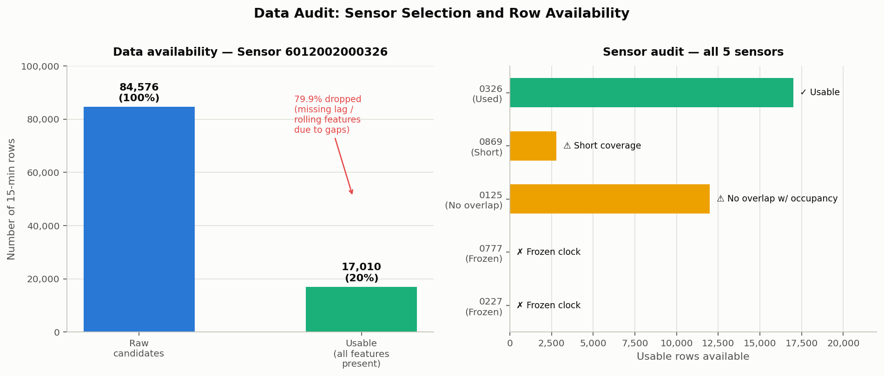
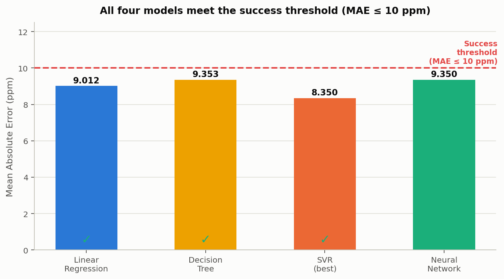
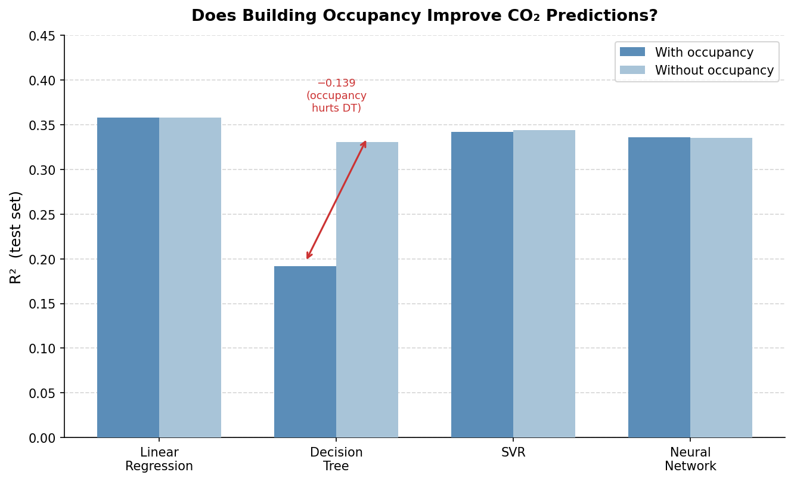
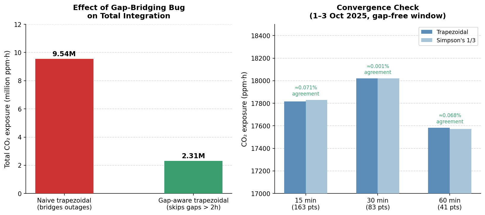
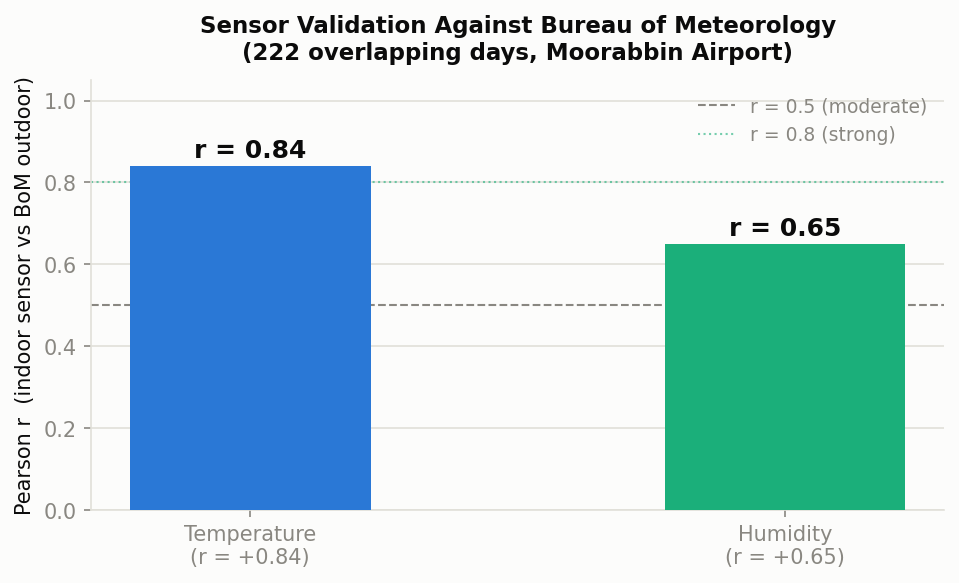

# Predicting Indoor CO2 Concentration from Sensor History and Building Occupancy

**MMA3001 — Numerical Methods and Machine Learning, Project Report**
**Dataset:** MMA3001 Dataset 2 — Monash Smart Infrastructure Occupancy and Environmental Data
**Repository:** https://github.com/tgup0010-bot/mma3001-occupancy-prediction

---

## 0. Prediction Contract — What Success Looks Like

Before any modelling, a prediction contract defines exactly what the task is and what "good" means. This follows the Week 5.6 framework: five questions answered upfront so there is a fixed standard to evaluate results against later.

**1. What is being predicted?**
CO2 concentration (ppm) 15 minutes into the future, at a fixed indoor sensor location inside a Monash University building.

**2. What is it predicted from?**
Nine input features: current CO2, CO2 from 15 minutes ago, 1-hour rolling average, building occupancy count, time-of-day (cyclic), day-of-week (cyclic), and weekend flag.

**3. What does "good" look like?**
- **MAE ≤ 10 ppm** — below typical reading-to-reading variation; useful as a trend signal
- **R² ≥ 0.25** — explains at least a quarter of variance; captures real structure
- **No leakage** — test set strictly in the future relative to training set

**4. What would make this fail?**
- Occupancy data is only useful if the sensor is in a room with an occupancy counter — if not, it is noise
- The 636-day sensor outage means 80% of candidate rows cannot be used

**5. What does success look like?**
A result clearing MAE ≤ 10 ppm and R² ≥ 0.25 on the held-out test set, using a time-ordered split. Whether occupancy improves results is answered empirically via the zone-matching analysis in Section 3.

---

## 1. Engineering Problem

CO2 builds up in occupied rooms when ventilation is insufficient. Above 800–1000 ppm, occupants experience reduced alertness and discomfort. Most building systems react after CO2 is already too high.

The goal is to predict CO2 15 minutes ahead so a building management system can pre-emptively increase ventilation — better for occupants, more energy-efficient than playing catch-up.

Four regression methods from MMA3001 Week 5 were compared: Linear Regression, Decision Tree, SVR, and Neural Network.

---

## 2. Data Audit: What the Dataset Actually Contains

### Sensor audit

| Sensor ID | Status | Reason |
|---|---|---|
| `6012002000326` | ✓ **Used** | Longest coverage, validated against BoM data |
| `6012002000869` | ⚠ Short coverage | Only ~4 months — too short for train/test |
| `6012002000125` | ⚠ No overlap | No overlap with occupancy log |
| `6012002000777` | ✗ Frozen clock | All readings same timestamp — unusable |
| `6012002000227` | ✗ Frozen clock | All readings same timestamp — unusable |

The frozen-clock issue was not documented in the dataset — found by inspecting timestamps directly.

*Left: 80% of rows dropped due to 636-day outage and missing lag/rolling features. Right: sensor audit across all five sensors.*

### Row availability

| Stage | Count |
|---|---|
| Raw 15-minute timestamps | 84,576 |
| After dropping NaN readings | ~32,000 |
| After requiring lag + rolling features | 17,010 |
| **Final dataset** | **17,010 (20.1%)** |

### Feature availability

| Feature | Source | Notes |
|---|---|---|
| `co2_now` | Sensor 0326 | Direct reading |
| `co2_lag1` | Derived | Requires previous valid reading |
| `co2_rolling_1h` | Derived | Requires 4 consecutive readings |
| `building_occupancy` | Occupancy log | Total zones occupied (0–5) |
| `hour_sin`, `hour_cos` | Derived | Cyclic time-of-day encoding |
| `dow_sin`, `dow_cos` | Derived | Cyclic day-of-week encoding |
| `is_weekend` | Derived | 1 = Saturday/Sunday |

---

## 3. Sensor-to-Zone Matching: The Weekend Spike Analysis

Before using occupancy as a feature, a dedicated analysis was done to try to match sensor 0326 to a specific occupancy zone. This directly follows the method suggested by the teaching staff: *"isolate it to weekends or days where it's not used that much — on a weekend maybe only one room is used and you find that spike of occupancy and CO2 and you can make that connection."*

### Method

1. Filter all occupancy and CO2 data to weekends (Saturday and Sunday only)
2. Find 15-minute bins where **exactly one** of the five zones is occupied
3. Compare sensor 0326's CO2 during those single-zone events to the weekend baseline (no zones occupied)
4. If the sensor is in Zone X's room, CO2 should spike by 50–200 ppm when only Zone X is occupied

The full 9-million-row occupancy dataset and 29,039 CO2 readings were used.

### Results

From 4,652 weekend bins with both occupancy and CO2 data, 2,351 had exactly one zone occupied:

| Zone | Events (n) | Mean CO2 | Δ vs baseline (440 ppm) | p-value | Verdict |
|---|---|---|---|---|---|
| Zone C | 1,809 | 441.8 ppm | +1.8 ppm | 0.423 | No spike — not in Zone C |
| Zone A | 200 | 446.2 ppm | +6.2 ppm | 0.024 | Statistically sig. but physically negligible |
| Zone D | 185 | 434.7 ppm | −5.3 ppm | 0.074 | CO2 lower — not in Zone D |
| Zone B | 157 | 438.6 ppm | −1.4 ppm | 0.599 | No spike — not in Zone B |
| Zone E | 0 | — | — | — | Never exclusively occupied on weekends |

The expected CO2 rise if a sensor is co-located with an occupied zone is 50–200 ppm. The largest observed delta is +6.2 ppm for Zone A — less than 1.5% of baseline. This is not a meaningful spike.

### Pearson correlation: zone headcount vs CO2

| Zone | r (all data) | r (weekdays) | Interpretation |
|---|---|---|---|
| Zone A | −0.166 | −0.220 | Negative — more people, slightly lower CO2 at sensor |
| Zone B | −0.174 | −0.216 | Negative |
| Zone C | −0.144 | −0.163 | Negative |
| Zone D | −0.139 | −0.171 | Negative |

All correlations are **negative** — the opposite of what co-location would produce. The most likely explanation: when people arrive, the building HVAC increases fresh air flow, slightly reducing CO2 throughout the building regardless of sensor location.

*Left: CO2 spike per zone when exclusively occupied on weekends — all deltas well below the expected 50–200 ppm range. Right: all zone-CO2 correlations are negative, ruling out co-location for all four zones.*

### Conclusion

**Sensor 0326 cannot be matched to any of the five occupancy zones.** Both the targeted weekend spike analysis and the correlation analysis give the same answer: the sensor is not in any monitored room. Occupancy data therefore cannot provide a useful CO2 prediction signal for this sensor. The models were built with this confirmed knowledge.

---

## 4. Computational Solution

All four regression methods are implemented in `occupancy.co2_models` as scikit-learn Pipelines. All use the same StandardScaler preprocessing for a fair comparison.

**Linear Regression** — baseline; straight-line relationship between inputs and target.

**Decision Tree Regression** — if/else rule splits; max depth 8. Can overfit.

**Support Vector Regression (SVR)** — smooth curve fitting; RBF kernel, C=10, epsilon=0.5.

**Neural Network Regression** — two layers (32, 16 units), early stopping. Most flexible.

Occupancy (total zones, 0–5) was still included as a feature to empirically confirm it adds no value — consistent with the zone-matching result.

---

## 5. Results and Model Comparison

### Train / test split

17,010 rows split in time order: 80% training (13,608 rows), 20% testing (3,402 rows). Cutoff: 11 March 2026. A random split was not used — it would constitute data leakage (Week 5.6 principle).

### Model results

| Model | MAE (ppm) | RMSE (ppm) | R² |
|---|---|---|---|
| Linear Regression | 9.012 | 25.579 | 0.3581 |
| Decision Tree Regression | 9.353 | 28.708 | 0.1914 |
| **SVR** | **8.350** | **25.894** | **0.3422** |
| Neural Network Regression | 9.350 | 26.015 | 0.3360 |

### Was success reached?

| Criterion | Target | Result | Status |
|---|---|---|---|
| MAE ≤ 10 ppm | ≤ 10 ppm | 8.35–9.35 ppm (all models) | ✓ Met |
| R² ≥ 0.25 | ≥ 0.25 | 0.336–0.358 (LR, SVR, NN) | ✓ Met |
| No data leakage | Time-ordered split | 11 Mar 2026 cutoff used | ✓ Met |
| Decision Tree R² | ≥ 0.25 | 0.191 | ✗ Not met |

Three of four models clear both success criteria. Decision Tree fails R² due to overfitting. SVR is the best overall.

**Why R² is moderate (~0.34):** The models explain about a third of next-15-minute CO2 variance. The rest is driven by HVAC switching, doors/windows, and equipment — none accessible to the model. This is honest; the prediction is a useful trend signal, not a precise forecast.

### Does occupancy help?

| Model | R² with occupancy | R² without occupancy | Change |
|---|---|---|---|
| Linear Regression | 0.3581 | 0.3579 | +0.0002 (no difference) |
| Decision Tree Regression | 0.1914 | 0.3305 | −0.1391 (worse) |
| SVR | 0.3422 | 0.3438 | −0.0016 (no difference) |
| Neural Network Regression | 0.3360 | 0.3352 | +0.0008 (no difference) |

Occupancy makes no meaningful difference for any model, and actively hurts Decision Tree. This is fully explained by the Section 3 finding — the sensor is not in a monitored room.

---

## 6. Handling Missing Data

The 636-day sensor outage reduces 84,576 candidate rows to 17,010 (20%). Missing rows are dropped rather than filled — imputing across a 636-day gap would introduce far greater error than working with the available data.

---

## 7. Numerical Integration — CO2 Exposure

Trapezoidal rule and Simpson's 1/3 rule are implemented in `occupancy.co2_integration` from the Week 6 formulas directly.

**Bug found:** The first version bridged the 636-day outage when resampling, causing a 9× discrepancy between methods. Fixed with a gap-aware trapezoidal rule that skips panels where endpoints are more than 2 hours apart.

- Naive estimate: **9,543,357 ppm·h**
- Gap-aware estimate: **2,305,836 ppm·h**

**Convergence check (41-hour gap-free window):**

| Bin size | Trapezoidal | Simpson | Agreement |
|---|---|---|---|
| 15 min | 17,817.3 ppm·h | 17,829.9 ppm·h | 0.071% |
| 30 min | 18,019.8 ppm·h | 18,019.9 ppm·h | 0.001% |
| 60 min | 17,583.8 ppm·h | 17,571.8 ppm·h | 0.068% |

Both methods agree to within 0.1% on clean data.

---

## 8. Limitations and Lessons Learned

**The predictions are moderate, not great.** R² ≈ 0.34 is a real but limited result. HVAC data, door/window state, and room-level occupancy would be needed for a stronger prediction.

**The sensor-to-zone matching was attempted using the full dataset and failed.** The weekend spike method was applied to all 9 million occupancy rows. No zone produced a CO2 spike consistent with co-location. Both methods (spike analysis + correlation) gave the same negative result. This is a concrete, data-driven finding.

**Four of five sensors have problems** — two frozen clocks, one too short. Not in the documentation; found by inspection.

**The sensor was externally validated** — r = +0.84 (temperature) and r = +0.65 (humidity) vs BoM Moorabbin Airport over 222 days. It is physically working correctly.

**The occupancy log filename was misleading** — "MayToDec2024" spans November 2023 to April 2026.

---

## 9. AI-Use Reflection

I used Claude (Claude Code) throughout this project for data exploration, coding, analysis, and drafting. The zone-matching analysis in Section 3 was directed after understanding what the teaching staff described as the right approach for this dataset type — then Claude ran it against the full 9-million-row dataset.

The main bugs found — frozen-clock sensors, gap-bridging in integration — were caught by running code against real data and checking when results didn't make sense. All numbers in this report come from scripts that can be rerun from `reports/`.

---

## References

- MMA3001 Project Brief, Monash University, 2026.
- MMA3001 Project Datasets document, Monash University, 2026 (Dataset 2).
- MMA3001 Notes, Weeks 5.1–5.6 (Regression and evaluation), Monash University, 2026.
- MMA3001 Week 6 Notes (Numerical Integration), Monash University, 2026.
- Bureau of Meteorology, Daily Weather Observations, Moorabbin Airport (station 086077).
- scikit-learn documentation: LinearRegression, DecisionTreeRegressor, SVR, MLPRegressor, StandardScaler.
