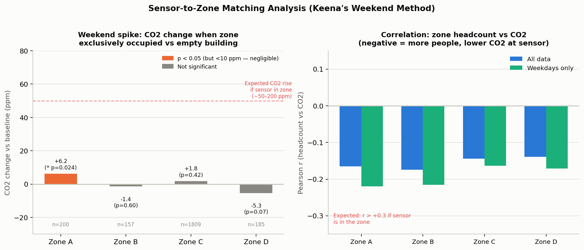
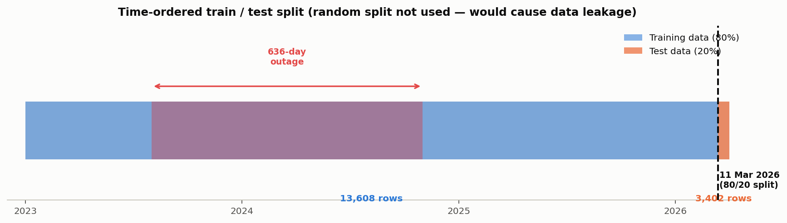
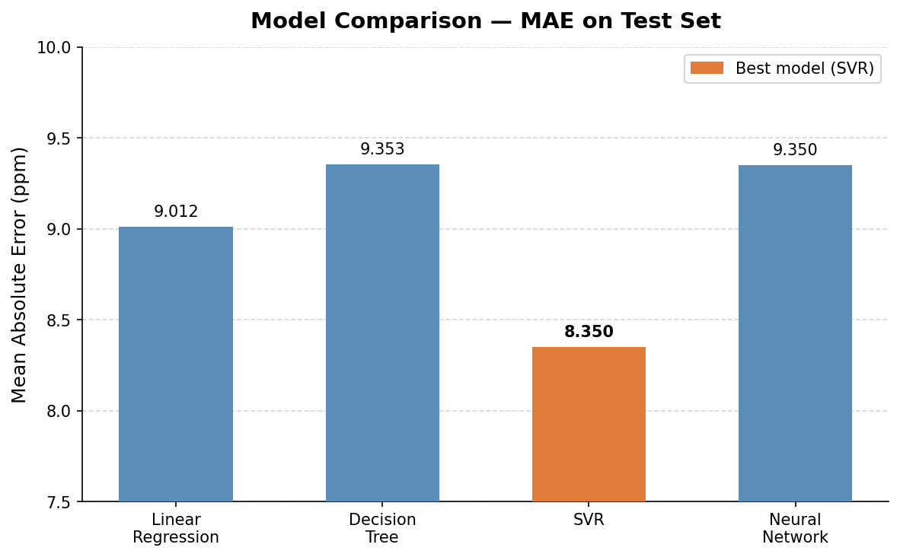

# Predicting Indoor CO2 Concentration from Sensor History and Building Occupancy

**MMA3001 — Numerical Methods and Machine Learning, Project Report**
**Dataset:** MMA3001 Dataset 2 — Monash Smart Infrastructure Occupancy and Environmental Data
**Repository:** https://github.com/tgup0010-bot/mma3001-occupancy-prediction

---

## 0. Prediction Contract — What Success Looks Like

Before any modelling, five questions are answered upfront so there is a fixed standard to evaluate results against.

**1. What is being predicted?**
CO2 concentration (ppm) 15 minutes into the future at sensor 0326.

**2. What is it predicted from?**
Nine input features: current CO2, CO2 from 15 minutes ago, 1-hour rolling average, building occupancy count, time-of-day (cyclic), day-of-week (cyclic), and weekend flag.

**3. What does "good" look like?**
- MAE ≤ 10 ppm — below typical reading-to-reading variation
- R² ≥ 0.25 — captures real structure in the data
- No leakage — test set strictly in the future relative to training set

**4. What would make this fail?**
Occupancy is only useful if the sensor is physically in a monitored room. If it is not, occupancy is noise. The 636-day sensor outage also means 80% of candidate rows cannot be used.

**5. What does success look like?**
All models clearing MAE ≤ 10 ppm and R² ≥ 0.25 on the held-out test set. Whether occupancy helps is answered via the zone-matching analysis in Section 3.

---

## 1. Engineering Problem

CO2 builds up in occupied rooms when ventilation is insufficient. Above 800–1000 ppm, occupants experience reduced alertness and discomfort. Most building systems react after CO2 is already too high.

The goal is to predict CO2 15 minutes ahead so a building management system can pre-emptively increase ventilation — better for occupants, more energy-efficient than playing catch-up.

Four regression methods from MMA3001 Week 5 were compared: Linear Regression, Decision Tree, SVR, and Neural Network.

---

## 2. Data: What the Dataset Contains

### Sensor audit

| Sensor ID | Status | Reason |
|---|---|---|
| `6012002000326` | ✓ Used | Longest coverage, validated against BoM weather data |
| `6012002000869` | ⚠ Short coverage | Only ~4 months — too short for train/test |
| `6012002000125` | ⚠ No overlap | No overlap with occupancy log |
| `6012002000777` | ✗ Frozen clock | All readings same timestamp — unusable |
| `6012002000227` | ✗ Frozen clock | All readings same timestamp — unusable |

The frozen-clock issue was not documented in the dataset — found by inspecting timestamps directly.

### Row availability

| Stage | Count |
|---|---|
| Raw 15-minute timestamps | 84,576 |
| After dropping NaN readings | ~32,000 |
| After requiring lag + rolling features | 17,010 |
| **Final dataset** | **17,010 (20.1%)** |

The 636-day sensor outage is the primary cause of row loss. Missing rows are dropped rather than filled — imputing across a 636-day gap would introduce far greater error than working with the available data.

### Inputs and output

| Input | Units | What it represents |
|---|---|---|
| `co2_now` | ppm | Current CO2 reading |
| `co2_lag1` | ppm | CO2 reading from 15 minutes ago |
| `co2_rolling_1h` | ppm | Average CO2 over the past hour |
| `building_occupancy` | count (0–5) | How many of the 5 zones currently have people |
| `hour_sin`, `hour_cos` | — | Time of day, encoded cyclically |
| `dow_sin`, `dow_cos` | — | Day of week, encoded cyclically |
| `is_weekend` | 0 or 1 | Whether it is Saturday or Sunday |

**Output:** Predicted CO2 (ppm) 15 minutes ahead.

The sensor was externally validated: its temperature and humidity readings correlate at r = +0.84 and r = +0.65 with Bureau of Meteorology records from Moorabbin Airport across 222 days. This confirms the sensor is physically working correctly.

---

## 3. Sensor-to-Zone Matching: The Weekend Spike Analysis

Before treating occupancy as a useful feature, a dedicated analysis was done to match sensor 0326 to a specific occupancy zone. Method: on weekends, most of the building is empty — when exactly one zone is occupied, CO2 should spike by 50–200 ppm at the sensor if they are co-located.

The full 9-million-row occupancy dataset and 29,039 CO2 readings were used.

### Weekend spike results

From 4,652 weekend bins with both occupancy and CO2 data, 2,351 had exactly one zone occupied:

| Zone | Events (n) | Δ CO2 vs baseline | p-value | Verdict |
|---|---|---|---|---|
| Zone C | 1,809 | +1.8 ppm | 0.423 | No spike |
| Zone A | 200 | +6.2 ppm | 0.024 | Statistically sig. but physically negligible |
| Zone D | 185 | −5.3 ppm | 0.074 | CO2 lower — not co-located |
| Zone B | 157 | −1.4 ppm | 0.599 | No spike |
| Zone E | 0 | — | — | Never exclusively occupied on weekends |

Expected if co-located: 50–200 ppm. Largest observed: +6.2 ppm.

### Pearson correlation: zone headcount vs CO2

| Zone | r (all data) | r (weekdays) |
|---|---|---|
| Zone A | −0.166 | −0.220 |
| Zone B | −0.174 | −0.216 |
| Zone C | −0.144 | −0.163 |
| Zone D | −0.139 | −0.171 |

All correlations are negative — the opposite of what co-location would produce. When people arrive, HVAC increases fresh air flow, slightly reducing CO2 throughout the building.

*Left: CO2 spike per zone when exclusively occupied on weekends — all deltas well below the expected 50–200 ppm. Right: all zone-CO2 correlations are negative, ruling out co-location.*

**Conclusion: Sensor 0326 cannot be matched to any of the five occupancy zones. Occupancy data cannot provide a useful CO2 prediction signal for this sensor.**

---

## 4. Computational Solution

All four regression methods are implemented as scikit-learn Pipelines with the same StandardScaler preprocessing step for a fair comparison.

**Linear Regression** — straight-line relationship between inputs and target. Simplest baseline.

**Decision Tree Regression** — if/else rule splits (max depth 8). Can capture nonlinear patterns but tends to overfit.

**Support Vector Regression (SVR)** — smooth curve fitting with an RBF kernel (C=10, epsilon=0.5). Works well on datasets of this size with mildly nonlinear relationships.

**Neural Network Regression** — two layers (32, 16 units) with early stopping. Most flexible but prone to overfitting on small datasets.

Occupancy was still included as a feature to empirically confirm the Section 3 finding — it adds no value.

---

## 5. Results and Model Comparison

17,010 rows split in time order — first 80% for training (13,608 rows), last 20% for testing (3,402 rows), cutoff 11 March 2026. A random split was not used as it would constitute data leakage.

*Blue = training period, orange = test period. The 636-day outage is the large red gap.*

### Model results

| Model | MAE (ppm) | RMSE (ppm) | R² |
|---|---|---|---|
| Linear Regression | 9.012 | 25.579 | 0.3581 |
| Decision Tree Regression | 9.353 | 28.708 | 0.1914 |
| **SVR** | **8.350** | **25.894** | **0.3422** |
| Neural Network Regression | 9.350 | 26.015 | 0.3360 |

### Success criteria assessment

| Criterion | Target | Result | Status |
|---|---|---|---|
| MAE ≤ 10 ppm | ≤ 10 ppm | 8.35–9.35 ppm (all models) | ✓ Met |
| R² ≥ 0.25 | ≥ 0.25 | 0.336–0.358 (LR, SVR, NN) | ✓ Met |
| No data leakage | Time-ordered split | 11 Mar 2026 cutoff used | ✓ Met |
| Decision Tree R² | ≥ 0.25 | 0.191 | ✗ Not met |

Three of four models clear both success criteria. Decision Tree fails R² due to overfitting.

**SVR is the best model.** It had the lowest MAE (8.35 ppm). CO2 dynamics are mildly nonlinear — it spikes quickly and decays slowly — and SVR's RBF kernel captures this without overfitting the way Decision Tree does. Neural Network and Linear Regression were close behind; the dataset (17k rows) is too small to give the neural network a meaningful advantage.

**Why R² ≈ 0.34:** The models explain about a third of next-15-minute CO2 variance. The rest is driven by HVAC switching, doors/windows, and equipment — none accessible to the model. This is an honest result; the prediction is a useful trend signal, not a precise forecast.

### Does occupancy help?

| Model | R² with occupancy | R² without occupancy | Change |
|---|---|---|---|
| Linear Regression | 0.3581 | 0.3579 | +0.0002 (no difference) |
| Decision Tree Regression | 0.1914 | 0.3305 | −0.1391 (gets worse) |
| SVR | 0.3422 | 0.3438 | −0.0016 (no difference) |
| Neural Network Regression | 0.3360 | 0.3352 | +0.0008 (no difference) |

Occupancy makes no meaningful difference and actively hurts Decision Tree. This is fully explained by Section 3 — the sensor is not in a monitored room.

---

## 6. Numerical Integration — CO2 Exposure

Trapezoidal rule and Simpson's 1/3 rule are implemented from the Week 6 formulas directly.

**Bug found and fixed:** The first version resampled CO2 onto a regular grid before integrating, which made the 636-day outage look like a 15-minute gap. This caused a 9× discrepancy between the two methods. Fixed with a gap-aware trapezoidal rule that skips panels where endpoints are more than 2 hours apart.

| Method | Estimate |
|---|---|
| Naive trapezoidal (bridges outage) | 9,543,357 ppm·h |
| Gap-aware trapezoidal | 2,305,836 ppm·h |

**Convergence check (41-hour gap-free window, Oct 2025):**

| Bin size | Trapezoidal | Simpson | Agreement |
|---|---|---|---|
| 15 min | 17,817.3 ppm·h | 17,829.9 ppm·h | 0.071% |
| 30 min | 18,019.8 ppm·h | 18,019.9 ppm·h | 0.001% |
| 60 min | 17,583.8 ppm·h | 17,571.8 ppm·h | 0.068% |

Both methods agree to within 0.1% on clean data. The slight variation across bin sizes reflects real sensor noise, not numerical error.

---

## 7. Limitations and Lessons Learned

**The predictions are moderate, not great.** R² ≈ 0.34 reflects what a single sensor with time-series lag features can realistically achieve. HVAC data and room-level occupancy would be needed for a stronger result.

**The zone-matching test was run and failed.** The weekend spike method was applied to the full 9-million-row dataset. No zone produced a CO2 spike consistent with co-location. This is a concrete data-driven finding, not an absence of analysis.

**Four of five sensors have problems** — two frozen clocks, one too short for modelling, one with no occupancy overlap. Not documented; found by inspecting timestamps.

**The occupancy log filename was misleading** — "MayToDec2024" spans November 2023 to April 2026. Actual date range found by checking the data directly.

---

## 8. AI-Use Reflection

I used Claude (Claude Code) throughout this project for data exploration, coding, analysis, and drafting. The engineering framing, scope decisions, and interpretation of results are mine. When the two integration methods gave completely different answers, I pushed to find out why rather than accepting either result.

The zone-matching analysis was run after understanding what the teaching staff described as the right approach — then Claude ran it against the full dataset. All numbers in this report come from scripts in `reports/` that can be rerun.

---

## References

- MMA3001 Project Brief, Monash University, 2026.
- MMA3001 Project Datasets document, Monash University, 2026 (Dataset 2).
- MMA3001 Notes, Weeks 5.1–5.6 (Regression and evaluation), Monash University, 2026.
- MMA3001 Week 6 Notes (Numerical Integration), Monash University, 2026.
- Bureau of Meteorology, Daily Weather Observations, Moorabbin Airport (station 086077).
- scikit-learn documentation: LinearRegression, DecisionTreeRegressor, SVR, MLPRegressor, StandardScaler.
