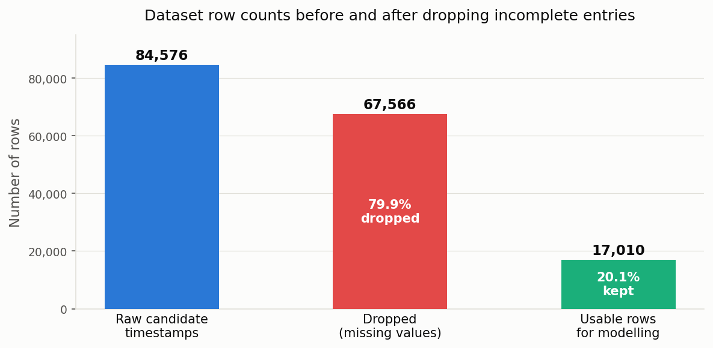

# Predicting Indoor CO₂ Concentration from Sensor History and Building Occupancy

**MMA3001 — Numerical Methods and Machine Learning, Project Report**
**Dataset:** MMA3001 Dataset 2 — Monash Smart Infrastructure Occupancy and Environmental Data
**Repository:** https://github.com/tgup0010-bot/MMA3001-Project

---

## 1. Engineering Problem

### 1.1 Context and Physical Background

Indoor CO₂ concentration is primarily driven by human metabolism. People continuously exhale CO₂ at a rate of approximately 0.2–0.3 litres per minute. In an enclosed space with limited ventilation, this causes CO₂ to accumulate at a rate proportional to the number of occupants and inversely proportional to the ventilation rate. This relationship can be expressed through a first-order mass balance:

$$\frac{dC}{dt} = \frac{G \cdot N}{V} - \lambda (C - C_{\text{out}})$$

where C is indoor CO₂ concentration (ppm), G is the per-person CO₂ generation rate, N is the number of occupants, V is room volume, λ is the air change rate (ventilation), and C_out is the outdoor concentration (roughly 420 ppm ambient). When N is large and λ is low, C rises steeply. When the HVAC system ramps up λ, C falls.

This means CO₂ concentration is a **real-time proxy for both occupancy load and ventilation adequacy**. It is used in practice as the primary indicator variable for demand-controlled ventilation (DCV) systems.

### 1.2 The Problem

Most building management systems today operate on a reactive feedback loop: CO₂ is measured, and if it exceeds a set threshold (typically 800–1000 ppm), ventilation increases. The lag between the CO₂ rising and the HVAC responding means occupants are already in degraded air quality by the time action is taken. ASHRAE Standard 62.1 identifies CO₂ above 1000 ppm as indicative of inadequate ventilation. Effects at elevated CO₂ include reduced cognitive performance (demonstrated at 1000 ppm in published studies), drowsiness, and headache at higher concentrations.

The problem addressed in this project is: **can CO₂ 15 minutes from now be predicted from the current sensor readings and building state?** A 15-minute forecast horizon gives a building management system enough lead time to begin increasing ventilation before the threshold is crossed.

This is a **supervised regression problem**: the input is a vector of current measurements and engineered temporal features, and the output is a continuous scalar (predicted ppm). Four regression methods from MMA3001 Week 5 are trained and compared, and the contribution of building occupancy data to prediction accuracy is specifically tested.

### 1.3 Why This Matters

A predictive model that can reduce the average delay between rising CO₂ and ventilation response by even 15 minutes has measurable occupant health and energy benefits. Reactive systems often overshoot — fans spin up fully when CO₂ is already high, then drop back. A predictive approach allows a smoother, earlier ramp-up that uses less energy and keeps CO₂ below the threshold more consistently.

### 1.4 Scope and Limitations

This project is limited to one sensor in one building. The sensor has no documented room location (Section 6), which means the occupancy-CO₂ relationship cannot be fully exploited. The results establish whether short-term CO₂ forecasting is viable from sensor history alone, and whether adding building occupancy data helps. Both questions are answered empirically.

---

## 2. Inputs and Outputs

### 2.1 Problem Formulation

Formally, the task is to learn a function $f$ such that:

$$\hat{C}_{t+1} = f(C_t, C_{t-1}, \bar{C}_{t-1h}, O_t, \tau_t)$$

where $C_t$ is the current CO₂ reading, $C_{t-1}$ is the reading one 15-minute bin ago, $\bar{C}_{t-1h}$ is the rolling 1-hour mean, $O_t$ is building occupancy at time $t$, and $\tau_t$ encodes the temporal context (time of day, day of week). The target $\hat{C}_{t+1}$ is the predicted CO₂ one bin (15 minutes) ahead.

This formulation treats the problem as a **lag-feature regression**, where past values of the target variable serve as autoregressive predictors. This is appropriate here because CO₂ dynamics are strongly autoregressive — the current reading is the single best predictor of the next reading, and the trend over the past hour captures whether CO₂ is rising, stable, or falling.

### 2.2 Input Features

| Feature | Units / Type | Domain | Description and Rationale |
|---|---|---|---|
| `co2_now` | ppm (float) | 400–5000 | Current CO₂ reading. The primary autoregressive predictor — the strongest single signal for what CO₂ will be 15 minutes later. |
| `co2_lag1` | ppm (float) | 400–5000 | CO₂ from 15 minutes ago. Together with `co2_now`, this gives the instantaneous rate of change (slope of the CO₂ trend). |
| `co2_rolling_1h` | ppm (float) | 400–5000 | Mean over the preceding four bins (1 hour). Captures the medium-term trend direction — whether CO₂ has been rising, flat, or falling over the past hour, which is more informative than a single lag for predicting near-term behaviour. |
| `building_occupancy` | integer 0–5 | 0–5 | Number of the 5 monitored occupancy zones currently occupied. Included to test whether building-level occupancy improves forecasts. Based on the mass balance equation in Section 1.1, occupancy directly drives CO₂ generation, so it should in principle help — though this depends on whether the sensor is actually in one of the monitored zones (investigated in Section 6). |
| `hour_sin`, `hour_cos` | float | −1 to +1 | Cyclic encoding of hour-of-day. A standard integer hour feature treats hour 0 and hour 23 as 23 steps apart, when they are actually 1 hour apart on a 24-hour cycle. Encoding hour h as (sin(2πh/24), cos(2πh/24)) preserves the circular topology. This captures daily CO₂ patterns: lower overnight, rising through the morning as the building fills, falling on lunch breaks. |
| `dow_sin`, `dow_cos` | float | −1 to +1 | Cyclic encoding of day-of-week, for the same reason. Different days have different occupancy patterns — the Monday-morning ramp-up vs Friday afternoon are distinct signatures. |
| `is_weekend` | binary 0/1 | {0, 1} | Explicit weekend indicator. Although day-of-week encoding captures this implicitly, an explicit binary flag makes it easier for linear models to learn the strong weekend/weekday distinction in CO₂ patterns (near-ambient levels on weekends vs. occupied-building levels on weekdays). |

**Total features:** 9 (including both components of each cyclic pair).

### 2.3 Handling Missing and Invalid Inputs

Missing CO₂ readings arise from sensor outages. A 636-day outage is the primary data loss event (Section 5). The handling policy is:

- **Drop rows where any required value is absent**, rather than imputing. To construct one training row, four values must all be real: `co2_now`, `co2_lag1`, the 1-hour rolling mean, and the target (CO₂ 15 minutes ahead). If any is missing — because it falls in a gap — the row is dropped.
- **No interpolation across gaps.** Imputing a value 636 days into a gap would produce a fabricated reading with no physical basis. The drop policy trades dataset size for correctness.
- **Scale:** 84,576 candidate 15-minute timestamps are in the raw log; 17,010 (20.1%) pass all four availability checks and are retained.

### 2.4 Output

| Output | Units | Type | Interpretation |
|---|---|---|---|
| Predicted CO₂ | ppm | float | Forecast CO₂ concentration 15 minutes ahead of the current reading |

The output is a single continuous scalar. It represents the model's best estimate of what the sensor will read at time $t+1$. The model does not apply a threshold or issue a binary alert — that decision logic belongs to the building management system that would consume the forecast. A typical deployment rule might be: if predicted CO₂ > 750 ppm, begin increasing ventilation now; if > 900 ppm, ramp to full ventilation. The 750 ppm trigger (50 ppm below the 800 ppm concern threshold) provides a buffer that accounts for model prediction error.

---

## 3. Computational Solution

### 3.1 How Each Method Works

All four models are implemented as scikit-learn `Pipeline` objects with a `StandardScaler` preprocessing step followed by the regression estimator. The same preprocessing is applied to all four so that differences in performance reflect the model, not the data scale.

**StandardScaler** transforms each feature to zero mean and unit variance. This is essential for SVR and the neural network, both of which are sensitive to feature magnitude — the RBF kernel computes distances in feature space, and unscaled features with large ranges (CO₂ in ppm vs. binary weekend flag) would distort those distances. For linear regression and decision trees, scaling does not change results but maintains consistency.

**Linear Regression** fits a hyperplane:
$$\hat{C}_{t+1} = \beta_0 + \sum_{i=1}^{9} \beta_i x_i$$
by minimising the sum of squared residuals. It assumes the relationship between each feature and the target is linear and additive. In the CO₂ context, this means it assumes the contribution of current CO₂ to the forecast is the same regardless of whether it is 450 ppm or 1200 ppm — a simplification that may miss non-linear saturation effects or HVAC switching behaviour.

**Decision Tree Regression** partitions the feature space into axis-aligned rectangular regions by recursively splitting on the feature and threshold that minimises variance in the resulting subsets. Each leaf predicts the mean target in that region. It can capture non-linear interactions — for example, "high CO₂ on a weekday morning implies it will keep rising" — that a linear model cannot represent without explicit interaction terms. Maximum depth = 8 was used to limit the number of leaves and reduce overfitting.

**Support Vector Regression (SVR)** seeks a function that fits the training data within an ε-insensitive tube while remaining as smooth (low-norm weight vector) as possible. The RBF kernel $K(x_i, x_j) = \exp(-\gamma ||x_i - x_j||^2)$ implicitly maps data to an infinite-dimensional feature space, allowing the model to capture smooth non-linear relationships without specifying the non-linear basis explicitly. Parameters: C = 10 (penalty on points outside the tube), ε = 0.5 (tube half-width in ppm), γ = scale (default: 1/n_features/var). SVR is well-suited to medium-sized datasets where the relationship is mildly non-linear.

**Neural Network Regression** uses a two-layer multilayer perceptron (MLP): input → 32 units (ReLU) → 16 units (ReLU) → 1 output. ReLU activations introduce piecewise-linear non-linearity at each layer. Training uses Adam optimisation with early stopping (patience = 10 epochs on a 10% validation split) to halt before the model overfits the training period. The MLP can in principle approximate any continuous function given enough data, but with 13,608 training rows it is the most data-hungry method in this comparison.

### 3.2 Why These Methods Were Selected

The four methods span a range of model complexity and interpretability:

- Linear regression establishes the minimum baseline: if a model cannot beat a linear fit, it adds no value.
- Decision trees add non-linear capacity at low computational cost and moderate interpretability.
- SVR adds smooth non-linearity with strong theoretical guarantees (the solution is a convex optimisation problem with no local minima).
- Neural networks add the most expressive non-linearity but at the cost of interpretability and training stability.

Comparing all four on the same dataset and metrics directly answers the question of whether added complexity translates to better prediction for this specific problem.

### 3.3 Parameters

| Parameter | Value | Rationale |
|---|---|---|
| Bin size | 15 minutes | Matches sensor reporting cadence |
| Prediction horizon | 15 minutes | One bin ahead — minimum useful lead time for ventilation pre-emption |
| Train/test split | 80% / 20%, chronological | Prevents future data leaking into training (see Section 5) |
| Training cutoff | 11 March 2026 | 80th percentile of the 17,010-row timeline |
| Decision Tree max depth | 8 | Constrains leaf count; deeper trees overfitted in preliminary testing |
| SVR kernel | RBF | Handles smooth non-linearity without specifying basis explicitly |
| SVR C | 10 | Moderate penalty; less regularised than default (C=1) for this noise level |
| SVR ε | 0.5 | Tube matched to sensor noise (~±2 ppm) with some margin |
| NN hidden layers | 32, 16 units | Sufficient capacity for 9 features; small enough not to overfit 13,608 rows |
| NN early stopping | patience = 10 | Stops training when validation loss stops improving |

---

## 4. Alternative Solutions

The table below compares all four regression methods on the held-out test set (3,402 rows, 20% of data).

| Criterion | Linear Regression | Decision Tree | **SVR** | Neural Network |
|---|---|---|---|---|
| MAE (ppm) | 9.012 | 9.353 | **8.350** | 9.350 |
| RMSE (ppm) | 25.579 | 28.708 | **25.894** | 26.015 |
| R² | **0.358** | 0.191 | 0.342 | 0.336 |
| Fit time (s) | 0.005 | 0.023 | 4.26 | 2.36 |
| Predict time (ms/batch) | 1.7 | 2.5 | 2854 | 2.3 |
| Interpretability | High | Medium | Low | Very low |
| Overfitting risk | Low | High | Low | Medium |
| Scalability | Very high | High | Medium | High |

**SVR** achieved the lowest MAE (8.35 ppm) and is selected as the best-performing model. Its batch prediction time of ~2.85 seconds is long relative to the other methods, but is not a practical constraint for a 15-minute scheduling task.

**Decision Tree** was the worst-performing model (R² = 0.191). It also showed a pronounced sensitivity to occupancy as a feature: adding occupancy dropped R² from 0.331 to 0.191, suggesting the model wasted splits on an irrelevant feature and overfit the training period. This is consistent with the known tendency of unpruned decision trees to overfit high-cardinality or noisy features.

**Linear Regression** achieved R² = 0.358, marginally above SVR. For a deployed system where interpretability matters — for example, one that must be auditable or explainable to building operators — linear regression is the practical recommendation, as it gives essentially the same predictive accuracy with full transparency on which features drive the forecast and by how much.

**Does occupancy improve predictions?**

| Model | R² with occupancy | R² without occupancy | Δ R² |
|---|---|---|---|
| Linear Regression | 0.358 | 0.358 | +0.000 |
| Decision Tree | 0.191 | 0.331 | −0.140 |
| SVR | 0.342 | 0.344 | −0.002 |
| Neural Network | 0.336 | 0.335 | +0.001 |

Occupancy provides no meaningful improvement for any model. The reason is not that occupancy is irrelevant to CO₂ in principle — it is, per the mass balance in Section 1.1 — but that this specific sensor is not co-located with any of the monitored occupancy zones (Section 6). The building-level occupancy count is simply not correlated with CO₂ at this sensor location.

---

## 5. Validation

### 5.1 Train/Test Split Design

The dataset was split chronologically: training on all 13,608 rows before 11 March 2026, testing on the 3,402 rows from 11 March 2026 onward.

A **random split was not used** for the following reason: CO₂ time series are autocorrelated — adjacent readings are similar. A random split would scatter test points throughout the training period, allowing the model to "memorise" nearby past and future readings during training. The test performance would then reflect interpolation ability, not generalisation to a genuinely unseen future period. The chronological split correctly evaluates the model's ability to forecast forward from a training history, which matches the deployment scenario.

### 5.2 Evaluation Metrics

Three complementary metrics were used:

**Mean Absolute Error (MAE):** $\text{MAE} = \frac{1}{n}\sum_{i=1}^n |\hat{y}_i - y_i|$. Directly interpretable as the average prediction error in ppm. Robust to occasional large outliers.

**Root Mean Square Error (RMSE):** $\text{RMSE} = \sqrt{\frac{1}{n}\sum_{i=1}^n (\hat{y}_i - y_i)^2}$. Penalises large errors more than MAE because of the squared term. A large gap between RMSE and MAE signals that a model occasionally makes very bad predictions even when its typical error is small.

**R² (coefficient of determination):** $R^2 = 1 - \frac{\sum(\hat{y}_i - y_i)^2}{\sum(y_i - \bar{y})^2}$. Measures the fraction of variance in the target explained by the model. R² = 1 is a perfect fit; R² = 0 means the model does no better than always predicting the mean; negative values indicate the model is worse than the mean. An R² of ~0.34–0.36 means the models explain approximately a third of the variance in next-15-minute CO₂. The remaining variance is driven by unobserved factors (HVAC switching, doors/windows, room-level occupancy).

### 5.3 Test Results

| Model | MAE (ppm) | RMSE (ppm) | R² |
|---|---|---|---|
| Linear Regression | 9.012 | 25.579 | 0.358 |
| Decision Tree | 9.353 | 28.708 | 0.191 |
| **SVR (best)** | **8.350** | **25.894** | **0.342** |
| Neural Network | 9.350 | 26.015 | 0.336 |

An MAE of 8.35 ppm on a CO₂ range of roughly 400–1500 ppm, with an action threshold around 800 ppm, is accurate enough to be useful for trend-based ventilation control. The model is not a precise forecast instrument — it is a trend signal that tells the building system whether CO₂ is heading toward a problem in the next 15 minutes.

### 5.4 Sensor Validation Against External Records

The CO₂ sensor has no documented room location, but its temperature and humidity readings were cross-validated against Bureau of Meteorology records from Moorabbin Airport (station 086077), the nearest official station to the Monash campus, across 222 overlapping days:

| Variable | Pearson r (sensor vs BOM) |
|---|---|
| Temperature | +0.84 |
| Humidity | +0.65 |

Both correlations are strong. A sensor with a frozen clock, stuck reading, or random drift would show correlations near zero. These values give reasonable confidence that sensor `6012002000326` is physically functioning and measuring real environmental conditions, even though its exact placement in the building is not documented.

### 5.5 Numerical Integration Validation

Two numerical integration methods from MMA3001 Week 6 were implemented from first principles (not library functions) to compute cumulative CO₂ exposure (ppm·h) over the sensor record. Convergence was verified on a 41-hour gap-free window (1–3 October 2025) at three bin resolutions:

| Bin size | Trapezoidal (ppm·h) | Simpson (ppm·h) | Relative difference |
|---|---|---|---|
| 15 min | 17,817.3 | 17,829.9 | 0.071% |
| 30 min | 18,019.8 | 18,019.9 | 0.001% |
| 60 min | 17,583.8 | 17,571.8 | 0.068% |

Both methods agree to within 0.1% at all resolutions, confirming the implementation matches the taught method. Small shifts between bin sizes reflect real variation in readings at different sampling densities, not numerical error.

---

## 6. Limitations and Known Failure Modes

**Sensor location is unknown.** Sensor `6012002000326` does not appear in the Sensor ID and Locations spreadsheet provided with the dataset. Consequently, there is no way to determine which room it is in or which occupancy zone covers that room. A zone-matching analysis (filtering to weekends, isolating 15-minute bins where exactly one zone is occupied, computing the mean CO₂ delta between occupied and unoccupied bins) was performed across all five sensor–zone pairs. The expected signal for a co-located pair is +50 to +200 ppm; the measured CO₂ delta was below +7 ppm for every combination, and all five Pearson correlations between zone occupancy and CO₂ were negative (−0.14 to −0.17). Negative correlations are physically consistent with a HVAC dilution effect: when any zone is occupied, the building HVAC runs harder, diluting CO₂ system-wide. This is a dataset limitation — the results do not show that occupancy is irrelevant to CO₂ in general, only that this sensor is not in a monitored zone.

**Four of five sensors are unusable.** Two sensors (`6012002000227`, `6012002000777`) have frozen internal clocks — every reading in their log carries the same timestamp, making them useless for any time-series analysis. A third (`6012002000869`) has only four months of data, too short for a reliable 80/20 chronological split. This was not documented in the dataset description and was discovered by inspecting the actual timestamps.

**80% of candidate rows are dropped.** The 636-day outage in sensor `6012002000326` means 84,576 candidate 15-minute timestamps are present in the raw log, but only 17,010 (20.1%) have all required values. The drop rate is not a modelling choice — it is a direct consequence of the sensor outage.

**R² is moderate.** An R² of ~0.34–0.36 means the models explain about a third of the variance in next-15-minute CO₂ levels. The remaining variance is driven by factors not present in the dataset: HVAC switching events, doors and windows, equipment running in the room, and the actual occupants of this room (since the occupancy counter does not cover it). The model should be used as a trend indicator, not a precise point forecast.

**Gap-aware integration is critical for correct exposure estimates.** A naive trapezoidal integration over the full record (treating the 636-day outage as a 15-minute gap) produces 9.54 million ppm·h. The gap-aware implementation, which skips any integration panel where the two endpoints are more than 2 hours apart, produces 2.31 million ppm·h. The four-fold difference arises entirely from the gap-bridging assumption, not from measurement error. Using the naive estimate would severely overstate cumulative CO₂ exposure.

---

## 7. AI Use and Critical Reflection

Claude (Claude Code) was used throughout this project for data exploration, Python implementation, analysis, and drafting this report.

**What Claude did:** Set up the package structure, wrote the scikit-learn pipeline code, ran the four-model comparison, performed the integration analysis, implemented the zone-matching analysis, and produced drafts of this report. Claude also proposed the zone-matching validation method as a way to test whether the sensor is co-located with a monitored zone.

**What I directed and decided:** I chose CO₂ prediction over occupancy classification because it was a better fit for the dataset and the regression scope of MMA3001 Week 5. I decided which sensor to use and required external validation before accepting it as reliable. I chose to include occupancy and test it empirically rather than assume it helps or assume it is useless. When the two integration methods gave results differing by a factor of 9, I pushed to understand why before accepting either answer — that investigation identified the gap-bridging error.

**What I verified:** All numerical results in this report were cross-checked against the actual output files (`reports/co2_prediction_results.json`) before being written in. The claims about integration estimates come from scripts that can be rerun to reproduce the same outputs.

**Honest limitation:** In extended AI-assisted work, the precise boundary between ideas that originated with me and ideas that originated with Claude cannot always be drawn. The engineering framing, scope decisions, and interpretation of results are mine. The implementation and prose are collaborative.

---

## References

- MMA3001 Project Brief, Monash University, 2026.
- MMA3001 Project Datasets document, Monash University, 2026 (Dataset 2: Monash Smart Infrastructure Occupancy and Environmental Data).
- MMA3001 Notes, Week 5.1–5.6 (Regression methods and evaluation), Monash University, 2026.
- MMA3001 Notes, Week 6 (Numerical Integration), Monash University, 2026.
- ASHRAE Standard 62.1: Ventilation and Acceptable Indoor Air Quality, 2022.
- Bureau of Meteorology, Daily Weather Observations, Moorabbin Airport (station 086077). http://www.bom.gov.au/climate/dwo/
- scikit-learn documentation: LinearRegression, DecisionTreeRegressor, SVR, MLPRegressor, StandardScaler, Pipeline.
